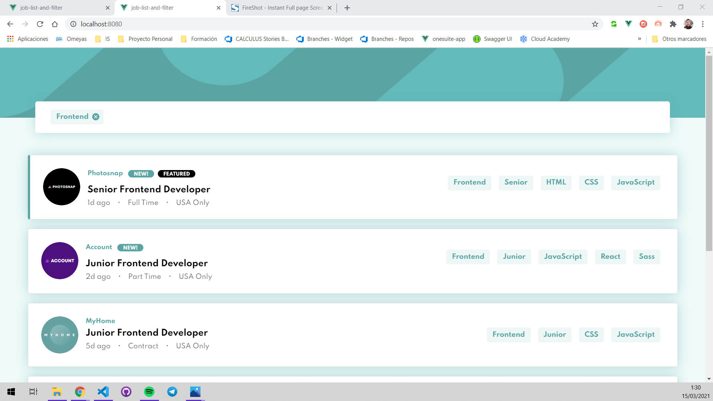

# Frontend Mentor - Job listings with filtering solution

This is a solution to the [Job listings with filtering challenge on Frontend Mentor](https://www.frontendmentor.io/challenges/job-listings-with-filtering-ivstIPCt). Frontend Mentor challenges help you improve your coding skills by building realistic projects. 

## Table of contents

- [Overview](#overview)
  - [The challenge](#the-challenge)
  - [Screenshot](#screenshot)
  - [Links](#links)
- [My process](#my-process)
  - [Built with](#built-with)  
- [Author](#author)
- [Acknowledgments](#acknowledgments)

**Note: Delete this note and update the table of contents based on what sections you keep.**

## Overview

### The challenge

Users should be able to:

- View the optimal layout for the site depending on their device's screen size
- See hover states for all interactive elements on the page
- Filter job listings based on the categories

### Screenshot

### Links

- Solution URL: [github/job-list-and-filter](https://github.com/josemasf/job-list-and-filter)
- Live Site URL: [jobfilter.netlify.app](https://jobfilter.netlify.app)

### Built with

- Semantic HTML5 markup
- CSS custom properties
- SASS
- Typescript
- [Vue](https://reactjs.org/) - JS library
- [Vuetify.js](https://vuetifyjs.org/) - UI framework

## Author

- Website - [JoseMa Santos](https://www.omeyasweb.com)
- Frontend Mentor - [@josemasd](https://www.frontendmentor.io/profile/josemasf)
- Twitter - [@josemasf](https://www.twitter.com/josemasf)